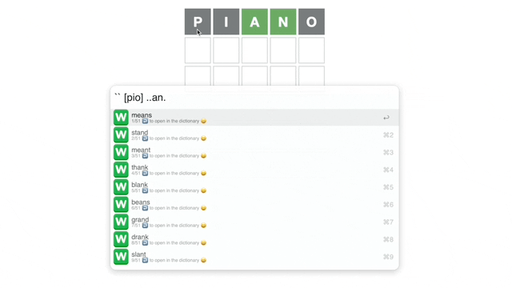

# alfred-wordle-cheater
 the title says it all, cheater

# Usage
- `` to launch
- `[abc]` to exclude letters
- `(abc)` to include letters
- `a...c` to force position
- ↩️ to open a word in the dictionary

I used the famous [GraphBase list](https://www-cs-faculty.stanford.edu/~knuth/sgb.html) of five-letter words by Donald Knuth (https://www-cs-faculty.stanford.edu/~knuth/sgb-words.txt)

<a href="https://github.com/giovannicoppola/alfred-wordle-cheater/releases/latest/">
  
   
</a>
